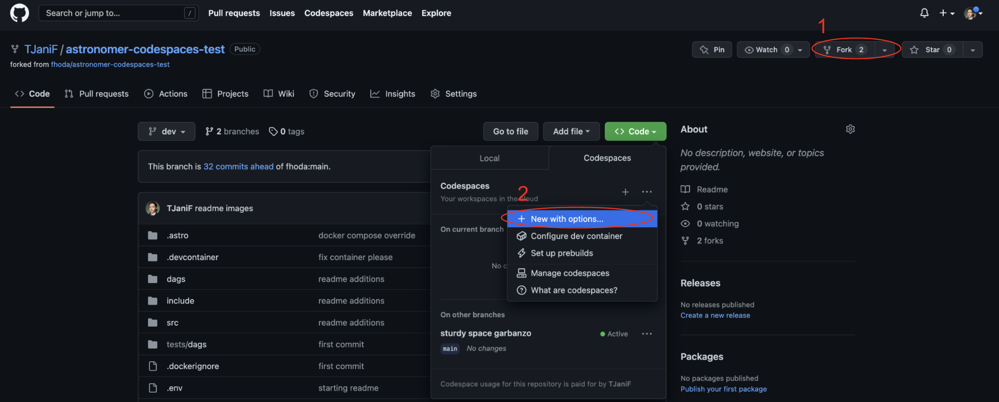
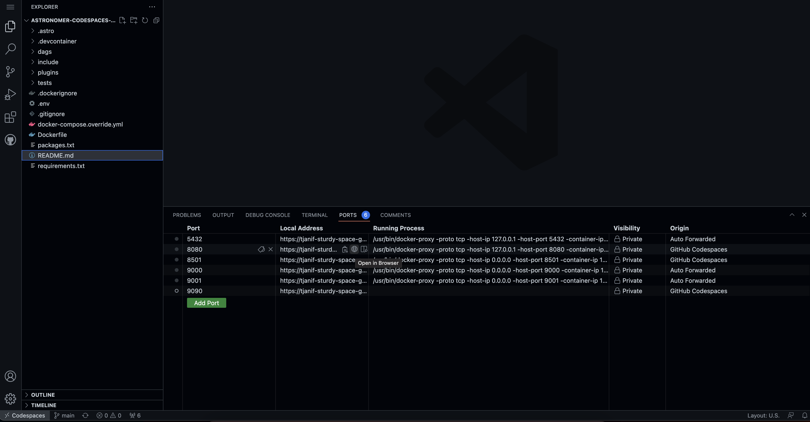
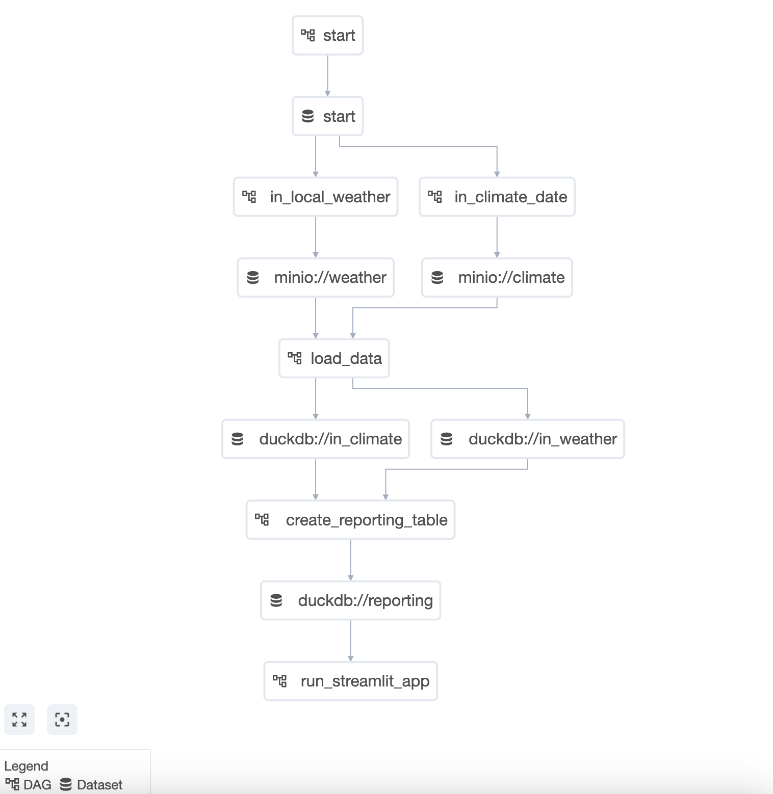
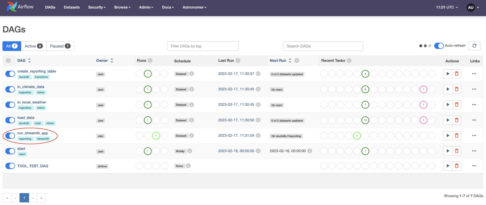
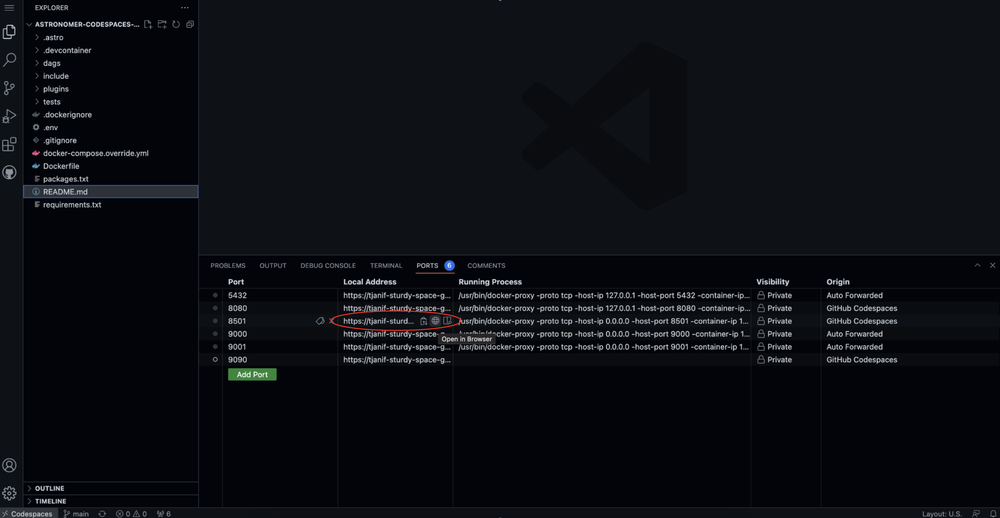
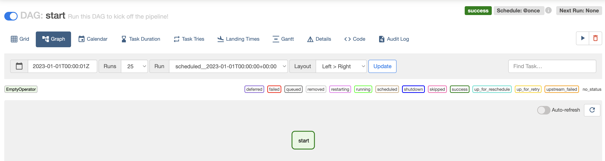
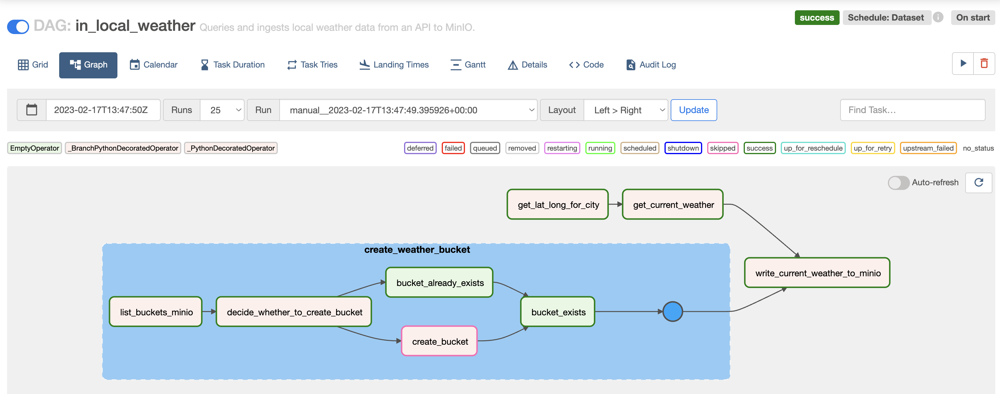
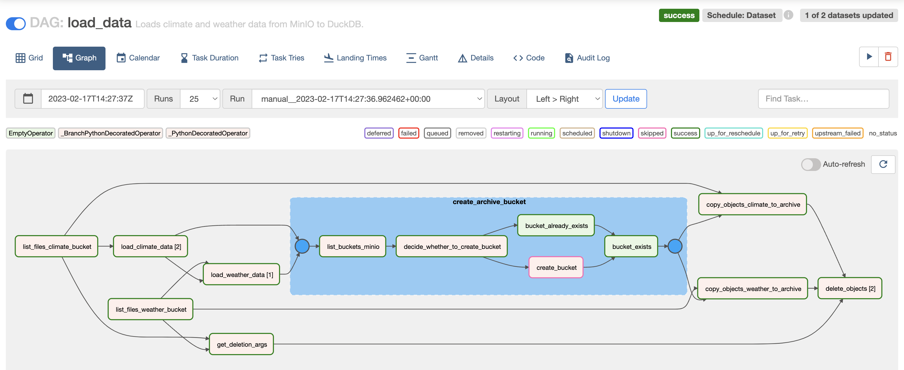
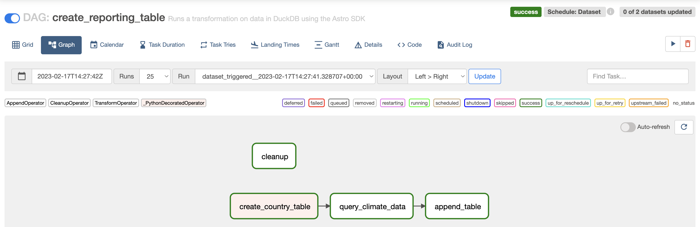
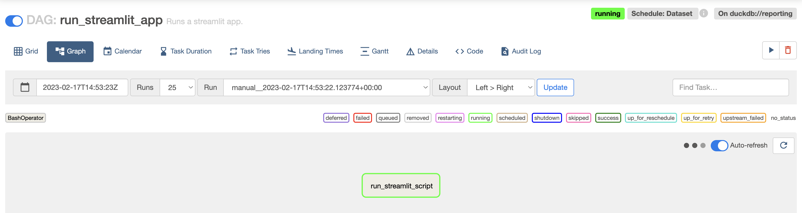

Overview
========

Welcome to this hands-on repository to get started with [Apache Airflow](https://airflow.apache.org/)! :rocket:

This repository contains a fully functional best practice Airflow ELT pipeline that can be run in GitHub codespaces (or locally with the [Astro CLI](https://docs.astronomer.io/astro/cli/install-cli)). 

This Airflow pipeline will:
- Ingest data from local csv files and a public API into a [MinIO](https://min.io/) container.
- Load data from MinIO to [DuckDB](https://duckdb.org/).
- Transform data within DuckDB using the [Astro SDK](https://astro-sdk-python.readthedocs.io/en/stable/index.html).
- Use a [streamlit](https://streamlit.io/) app to display your data.

Use this repository to explore Airflow, experiment with your own DAGs and as a template for your own projects, as well as your own custom operators and task groups!

This project was created with :heart: by [Astronomer](https://www.astronomer.io/).

> If you are looking for an entry level written tutorial where you build your own DAG from scratch check out: [Get started with Apache Airflow, Part 1: Write and run your first DAG](https://docs.astronomer.io/learn/get-started-with-airflow).

> This repository is complete and meant to be used as a blueprint to build on or to explore Airflow features. A very similar repository that includes specific exercises to learn more about Datasets, dynamic task mapping and the Astro Python SDK is the [Airflow Quickstart](https://github.com/astronomer/airflow-quickstart).

-------------------------------

How to use this repository
==========================

## Setting up

### Option 1: Use GitHub Codespaces

Run this Airflow project without installing anything locally.

1. Fork this repository.
2. Create a new GitHub codespaces project on your fork. Make sure it uses at least 4 cores!

    

3. After creating the codespaces project the Astro CLI will automatically start up all necessary Airflow components. This can take a few minutes. 
4. Once the Airflow project has started access the Airflow UI by clicking on the **Ports** tab and opening the forward URL for port 8080.

    

### Option 2: Use the Astro CLI

Download the [Astro CLI](https://docs.astronomer.io/astro/cli/install-cli) to run Airflow locally in Docker. `astro` is the only package you will need to install.

1. Run `git clone https://github.com/TJaniF/astronomer-codespaces-test.git` on your computer to create a local clone of this repository.
2. Install the Astro CLI by following the steps in the [Astro CLI documentation](https://docs.astronomer.io/astro/cli/install-cli). The main prerequisite is Docker Desktop/Docker Engine but no Docker knowledge is needed to run Airflow with the Astro CLI.
3. Run `astro dev start` in your cloned repository.
4. After your Astro project has started. View the Airflow UI at `localhost:8080`.

## Run the project

1. Go to `include/global_variables/global_variables.py` and enter your own info for `MY_NAME` and `MY_CITY`.
2. Unpause all DAGs, starting top to bottom, by clicking on the toggle on their left hand side. Once the `start` DAG is unpaused it will run once, starting the pipeline. You can also run this DAG manually to trigger further pipeline runs by clicking on the play button on the right side of the DAG. The `TOOL_TEST_DAG` will only run if you manually do so.
4. Watch the DAGs run according to their dependencies which have been set using [Datasets](https://docs.astronomer.io/learn/airflow-datasets).

    

5. The last DAG in the pipeline `run_streamlit_app`, will stay in a running state as shown in the screenshot below.

    

6. Open the Streamlit app. If you are using codespaces go to the **Ports** tab and open the URL of the forwarded port `8501`. If you are running locally go to `localhost:8501`.

    

7. View the Streamlit app.

    

-------------------------------

How it works
============

## Components and infrastructure

This repository uses a [custom codespaces container](https://github.com/astronomer/devcontainer-features/pkgs/container/devcontainer-features%2Fastro-cli) to install the [Astro CLI](https://docs.astronomer.io/astro/cli/install-cli). The GH codespaces post creation command will start up the Astro project by running `astro dev start`. 

5 Docker containers will be created and relevant ports will be forwarded:

- The Airflow scheduler
- The Airflow webserver
- The Airflow metastore
- The Airflow triggerer
- A MinIO instance

## The Astro project

The Astro project defines a data pipeline using 7 DAGs that depend on each other using the Datasets feature. Datasets can be used to schedule a DAG to run based upon specific tasks finishing in other DAGs. Learn more about how to use Datasets in the [Datasets and data-aware scheduling in Airflow](https://docs.astronomer.io/learn/airflow-datasets) guide.
Supporting files are located in the `include` folder with the `include/global_variables/global_variables.py` containing the variables names and configurations.

In this section each DAG is explained in more detail.

#### start

The `start` DAG exists for user convenience and to create an [Airflow Pool](https://docs.astronomer.io/learn/airflow-pools) called `duckdb` with one worker slot in order to prevent tasks running queries against DuckDB from overlapping. Upon unpausing the DAG it will run once and afterwards can be used to manually start a run of the whole data pipeline. This DAG contains one task using the [BashOperator](https://registry.astronomer.io/providers/apache-airflow/modules/bashoperator) to create the pool and produce to the `start` Dataset.

This DAG as all DAGs in this project uses the `@dag` decorator from the TaskFlow API. Learn more in [Introduction to Airflow decorators](https://docs.astronomer.io/learn/airflow-decorators).

#### in_climate_data

This DAG will use a re-useable task group to create a `climate` bucket in MinIO if such a bucket does not already exist. The task group is instantiated using the `CreateBucket` class in `/include/custom_task_groups/create_bucket.py`. 

Learn more about task groups in the [Airflow task groups](https://docs.astronomer.io/learn/task-groups) guide and more about how to create reuseable task groups in the [Reusable DAG Patterns with TaskGroups](https://www.astronomer.io/events/live/reusable-dag-patterns-with-taskgroups/) webinar.

After preparing the bucket. The DAG uses the custom `LocalFilesystemToMinIOOperator` to ingest each file located in `include/climate_data` into MinIO. The operator uses dynamic task mapping, which makes it easy to add other `local_file_path`/`object_name` pairs to ingest additional files. Dynamic task mapping is an Airflow feature that allows you to adjust the number of tasks used dynamically at runtime. See also the [Create dynamic Airflow tasks](https://docs.astronomer.io/learn/dynamic-tasks) guide.

#### in_local_weather

As the `in_climate_data` DAG, this DAG will use the re-useable `CreateBucket` class to instantiate a task group creating a bucket called `weather` in case it does not exist in the MinIO instance already.

In parallel the DAG will convert the city name you provided to coordinates and query an open API to retrieve the current weather for that location. 

The last task in the DAG writes the API response to the MinIO bucket using the `LocalFilesystemToMinIOOperator`.

This DAG passes information from one task to another using XCom. Learn more about this core Airflow feature in the [Pass data between tasks](https://docs.astronomer.io/learn/airflow-passing-data-between-tasks) guide.

#### load_data

This DAG will first retrieve lists of objects in the MinIO weather and climate buckets in order to load the contents of these objects into tables within DuckDB. After this step the `CreateBucket` class is used to create an `archive` bucket where all objects from the `weather` and `climate` bucket are copied into, before they are deleted from their ingestion buckets. This pattern ensures that only recent data is being processed every time the pipeline runs.

#### create_reporting_table

This DAG uses another Astronomer Open Source project, the [Astro SDK](https://astro-sdk-python.readthedocs.io/en/stable/index.html) to run a transformation statement on data in DuckDB. The result from this transformation statement which uses partitions to create temperature averages for each decade as well as year and month, is stored in a new table. You can learn more about the Astro SDK in the [Write a DAG with the Astro Python SDK](https://docs.astronomer.io/learn/astro-python-sdk) tutorial. 

#### run_streamlit_app

The last DAG in the pipeline is special in that it will stay in a running state for you to be able to explore the local streamlit app until either you manually mark the DAG as successful or failed or a full hour has passed. The DAG uses the BashOperator to run the streamlit app located at `include/streamlit_app/weather_v_climate.py`. The app pulls information from the data that was loaded and transformed into DuckDB during this pipeline.

#### TOOL_TEST_DAG

This DAG exists as a convenience to test the tools Airflow is connecting to. It will retrieve a list of all buckets from MinIO, a list of all tables in the local DuckDB database and run a self-contained demo streamlit app.

-------------------------------

Project Structure
================

This repository contains the following files and folders:

- `.astro`: files necessary for Astro CLI commands.
- `.devcontainer`: the GH codespaces configuration.

-  `dags`: all DAGs in your Airflow environment. Files in this folder will be parsed by the Airflow scheduler when looking for DAGs to add to your environment. You can add your own dagfiles in this folder.
    - `ingestion`: two DAGs performing data ingestion.
    - `load`: one DAG performing data loading from MinIO to DuckDB.
    - `report`: one DAG running a streamlit app using data from DuckDB.
    - `transform`: one DAG using the Astro SDK to transform a table in DuckDB.
    - `start.py`: a DAG to kick off the pipeline.
    - `TOOL_TEST_DAG.py`: a DAG to test the connections to DuckDB, MinIO and Streamlit.

- `include`: supporting files that will be included in the Airflow environment.
    - `climate_data`: two csv files containing climate data.
    - `custom_operators`: a folder containing one Python file with several custom operators to interact with MinIO.
    - `custom_task_groups`: one python file which contains a class instantiating a task group to create a bucket in MinIO if it does not exist already.
    - `global_variables`: one python file which contains global variables and utility functions.
    - `streamlit_app`: one python file defining a Streamlit app using the data in our pipeline.
    - `tool_testing`: one python file with a demo Streamlit app not dependent on pipeline data for the `TOOL_TEST_DAG`. 
    - (`minio`): folder that is created upon first start of the Airflow environment containing supporting file for the MinIO instance.

- `plugins`: folder to place Airflow plugins. Empty.
- `src`: contains images used in this README.
- `tests`: folder to place pytests running on DAGs in the Airflow instance. Contains default tests.
- `.dockerignore`: list of files to ignore for Docker.
- `.env`: environment variables. Contains the definition for the DuckDB connection.
- `.gitignore`: list of files to ignore for git. Note that `.env` is not ignored in this project.
- `docker-compose.override.yaml`: Docker override adding a MinIO container to this project, as well as forwarding additional ports.
- `packages.txt`: system-level packages to be installed in the Airflow environment upon building of the Dockerimage.
- `README.md`: this Readme.
- `requirements.txt`: python packages to be installed to be used by DAGs upon building of the Dockerimage.